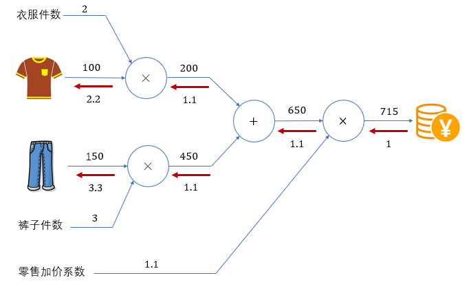

说明

该仓库为深度学习代码学习，希望能在2个月内入门深度学习代码！！！

在保研期间过了很多理论知识，所以现在很多基础知识都很清晰，学习起来非常舒服！

## 每日的简单记录

##### 第一天 2025.9.27

正式开始学习，看到尚硅谷出了深度学习课程，发现确实不错。

今天才知道不用 **pytorch**，神经网络到底怎么写，非常有意思！当然，今天的学习提醒我必须恶补python基础了，计划把之前学过的算法全部都用python实现一遍。

##### 第二天 2025.9.28 

学了一些pandas以及numpy的知识，也用numpy实现了最简单的神经网络的批处理（也就是把训练集 n * xxx）划分为（batch_size * xxx），具体就是用个for循环，当然，为了提升python代码能力，已经开始把c++的板子用python实现了，但是来这个深度学习仓库记录有点违和...

**比较重要的知识：**
正常list切片：[start : end : step]；numpy这种方式，还支持布尔切片（可以是布尔数组，也可以是布尔条件）,花式索引（其实就是很多索引对）
而pandas得数据结构分为series以及dataframe，其中series是一维带标签数组，默认为从0开始的数字索引；dataframe是一个二维表格数据，也就是既有行索引，也有列索引。

##### 第三天 2025.9.29
注：今天敲了8道模板题，python代码能力感觉得到了很大的提升，再接再厉！
今天主要学习了深度学习用到的数学知识
1）导数的定义以及在工程应用中如何求导数（数值微分）为了提高精度，可以用中心差分这一技巧
2）偏导数实际就是多元函数的导数，只不过在计算某个变量的偏导数时，把其他变量看成常数。不同变量的偏导组成的向量就是梯度，它指明了函数变化最快的方向，其模长就是变化率。

##### 第四天 2025.10.02
前两天出去玩去了，hhh。
今天主要学了梯度下降算法Sgd，但是直接用中心差分计算求解速度很慢，而优化算法BP能够加快梯度的计算。
BP引出了计算图的概念，其本质就是链式求导法则，当我们从损失函数出发，来求解不同参数对于损失函数的导数时，就可以利用之前求过的梯度来计算。

